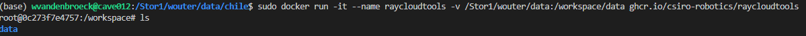
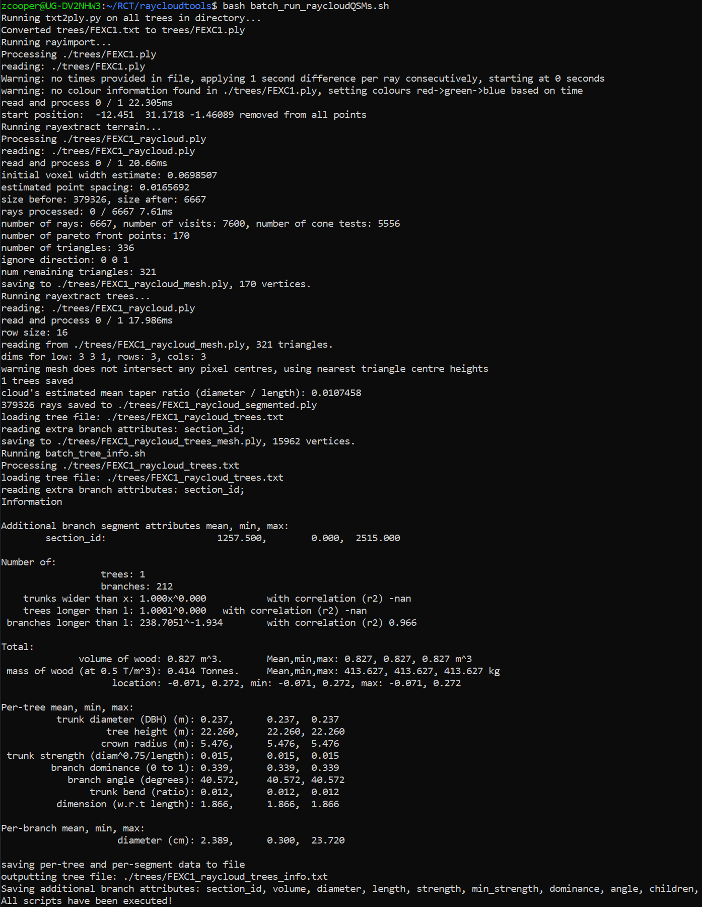
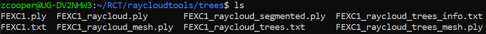

# Rayextract manual
Repository with explanation and additional functionality for using [Raycloudtools](https://github.com/csiro-robotics/raycloudtools) for forest point cloud processing

## Installation

## Via Docker

The easiest ways to use Raycloudtools is via using [Docker](https://www.docker.com/). Docker is a software that makes a 'closed of' environment on your computer that contains an operating system (OS) and all required packages for a certain applications. Once you have Docker installed, you can just use/download the pre-made Docker 'image', start the image (a running image is called a 'container') and you're good to go. As the Docker image contains an OS, it works on both Linux and Windows.

1. Install Docker
2. Download the latest raycloudtools docker image:

```
docker pull ghcr.io/csiro-robotics/raycloudtools:latest
```

You can check the available docker images on you computer with the command ```docker images```

3. Run the container:

On linux
```
docker run -it --name raycloudtools -v /home/yourusername:/workspace ghcr.io/csiro-robotics/raycloudtools:latest /bin/bash
```
You might have to use `sudo` before the command for root permissions.
You can check running docker containers with the command `docker container list`

On Windows
```
docker run -it --name raycloudtools -v C:/Users/YourUsername:/workspace ghcr.io/csiro-robotics/raycloudtools:latest /bin/bash
```

Replace /home/yourusername or C:/Users/YourUsername with the path to your home directory. As all files are normally packaged within the docker container, to communicate with the filesystem outside the container, we use the -v flag to map the filesystem in the container to the filesystem on your computer. The first part before the ':' is the directory on your own computer, that you want to map to the directory in the container (after the ':').  



You now have access to a bash terminal inside the container. Here you can run all the commands described in the next section. To exit the docker container you can press CTRL+d.


## Usage

It is assumed that you have a forest plot or tree point cloud in '.ply' format. Just XYZ is enough. 

### Convert pointcloud to raycloud

Raycloudtools expects a '.ply' file with in the normal fields the scanner location (note that for the Rayextract tools useful for forest point cloud processing these are not actually used). The `rayimport` command can add these (empty) fields to your input ply file: 

```
rayimport your_pointcloud.ply ray 0,0,-1 --max_intensity 0 --remove_start_pos; 
```

Note that we subtract the start position of the pointcloud, to start at 0,0,0.

The output is a file called 'your_pointcloud_raycloud.ply' in the same directory. 

### Extract terrain mesh

```
rayextract terrain your_pointcloud_raycloud.ply
```

The output is a file 'your_pointcloud_raycloud_mesh.ply', which is a terrain mesh file.

### Extract trees

To extract the trees we give as input the pointcloud (your_pointcloud_raycloud.ply) and the extracted terrain mesh (your_pointcloud_raycloud_mesh.ply). The `rayextract trees` command will use the mesh as seed points and simultaniously build a shortest path graph through all the tree points, using some heuristics to guide the connectivity. Hence, it combines the tree instance segmentation step and the cylinder fitting (i.e., QSM) building step.   

```
rayextract trees your_pointcloud_raycloud.ply your_pointcloud_raycloud_mesh.ply
```

The output is (1) a your_pointcloud_raycloud_trees.txt file (called 'treefile'), which contains the cylinder models of all the extracted trees (one line per tree), (2) a your_pointcloud_raycloud_segmented.ply file, which is the original pointcloud with unique color for each extracted tree, and (3) a your_pointcloud_raycloud_trees_mesh.ply file, which contains all tree stems as meshes. 

The format of the treefile is explained in more detail in the [treetools](https://github.com/csiro-robotics/treetools) library, which contains functionality for working with treefiles. The treefiles library is also already installed in the docker image. Below are some examples of commands you can run.

Get more info for all trees:

```
treeinfo treefile.txt 
```

Split into separate file for each tree:

```
treesplit treefile.txt per-tree
```

Convert to mesh file:

```
treemesh treefile.txt
```

### Use with large plots

For large point clouds where Rayextract may crash because of memory limitations, you can use the provided [bash script](https://github.com/qforestlab/raycloudtools/blob/main/scripts/rayextract_trees_large.sh), which runs `raysplit` to split point cloud into tiles with a certain buffer, runs `rayextract terrain` and `rayextract trees` for each tile (keeping only trees with base of the stem within the tile), and combines the trees to a single treefile.txt.

For example:
```
bash <path_to_file>/rayextract_trees_large.sh cloudname 20
```
To use tiles of 20x20m. We recommend increasing the default buffer size of 5m in the script a bit (depending on the max width of the trees).

## Additional scripts

### Calculate volume for all trees in a treefile

You can use the treefile2volume.py python script:

``` 
python treefile2volume.py <directory_with_treefile(s)> <output_volume.csv>
```

It assumes a file `filename_raycloud_trees.txt` in the specified directory.

### Visualise treefile

You can use the functions in `visualise_treefile.py`

### Run rayextract for single tree point clouds

You can use the bash script `rayextract_single_trees.sh` to loop over single tree point clouds in a directory (.ply format) and run rayimport -> rayextract terrain -> rayextract trees on each tree:

```
bash rayexctract_single_trees.sh <path_to_directory>
```

### Convert treefile to TreeQSM format

You can use the functions in `treefile2treeQSM.py`

### Separate instances

You can use the script `separate_instances.py` to separate the pointcloud_raycloud_segmented.ply output into individual trees: 

```
python scripts/separate_instances.py -i <input_name>_raycloud_segmented.ply
    - (optional) -o/--odir: output directory to write separate instances to, defaults to <directory of input>/trees
    - (optional) -p/--prefix: prefix to give tree names, defaults to “tree”
```

### Loop over all files in a directory

You can use the bash script loop_directory, which loops over all files in a directory and executes a certain command. For example, to convert all indivdual trees to tree meshes:

```
bash ./loop_directory.sh <your_directory> treemesh
```

## Install From Source (alternative to docker)

If you want an alternative to docker, or a static image of raycloudtools locally, you can install from source with the following instructions:

1. Install the 'extra' libraries needed for our specific funcionality of rayextract and treetools.
   It's recommended to install all the following in /home/user, or another level down in a custom directory

   a. LASzip
   ```
   git clone https://github.com/LASzip/LASzip.git
   cd LASzip
   git checkout tags/2.0.1
   mkdir build
   cd build
   cmake ..
   make
   sudo make install
   ```
   b. libLAS
   ```
   sudo apt-get install libboost-all-dev
   git clone https://github.com/libLAS/libLAS.git
   cd liblas
   mkdir build
   cd build
   cmake .. -DWITH_LASZIP=ON
   make
   sudo make install
   ```
   c. qhull
   ```
   git clone http://github.com/qhull/qhull.git
   cd qhull
   checkout tags/v7.3.2
   mkdir build
   cd build
   cmake .. -DCMAKE_POSITION_INDEPENDENT_CODE:BOOL=true
   make
   sudo make install
   ```
   
2. Install the core of raycloudtools and treetools

   a. Raycloudtools
   ```
   sudo apt-get install libeigen3-dev
   git clone https://github.com/ethz-asl/libnabo.git
   cd libnabo
   git checkout tags/1.0.7
   mkdir build
   cd build
   cmake .. -DCMAKE_BUILD_TYPE=RelWithDebInfo
   make
   sudo make install
   cd ../..
   git clone https://github.com/csiro-robotics/raycloudtools.git
   cd raycloudtools
   mkdir build
   cd build
   cmake .. -DWITH_LAS=ON -DWITH_QHULL=ON
   make
   ```
   b. TreeTools
   ```
   git clone https://github.com/csiro-robotics/treetools
   mkdir build
   cd build
   cmake ..
   make
   ```
   
3. Edit your bashrc via:
   ```
   sudo nano ~/.bashrc
   ```
   At the end of the file, add three lines:
   ```
   export PATH=$PATH:~/RCT/raycloudtools/build/bin
   export PATH=$PATH:~/RCT/treetools/build/bin
   console export LD_LIBRARY_PATH=$LD_LIBRARY_PATH:/usr/local/lib
   ```
   These three lines allow you to call tools from both packages in any directory (important for batching scripts), and paths them to required lib files.
   **Restart your console for this step to take effect**
   
4. Set up batching in the /raycloudtools directory

   a. Create a directory for individual tree processing
   ```
   mkdir trees
   ```
   b. Place the following batch scripts in /raycloudtools (scripts available in this repo)<br />
   Original credit for .sh scripts to Tom Verhelst, and txt2ply.py to Wouter Van den Broeck
   <br />
   batch_run_raycloudQSMs.sh<br />
   batch_rayimport.sh<br />
   batch_rayextract_terrain.sh<br />
   batch_rayextract_trees.sh<br />
   batch_tree_info.sh<br />
   txt2ply.py<br />
   <br />
5. Run test<br />
   Place one individual point cloud .txt file in /raycloudtools/trees, and run the following:
   ```
   bash batch_run_raycloudQSMs.sh
   ```
   If successful, you should have a print that looks like the following:
   
   Additionally, you should have files similar to the following in /trees:
   

6. Setup complete, for QSM creation, place trees in /trees directory and run `bash batch_run_raycloudQSMs.sh`<br />

   
