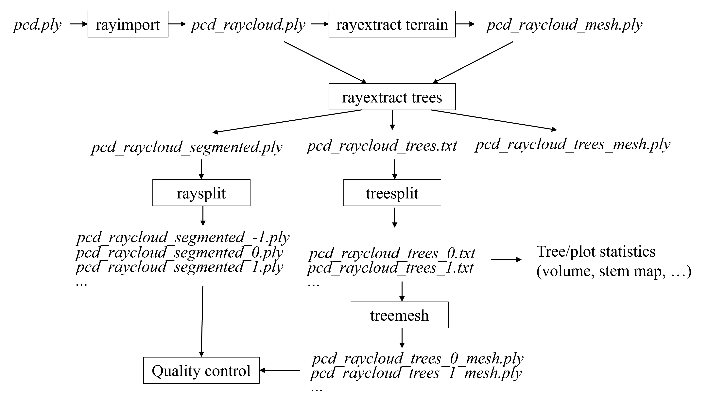
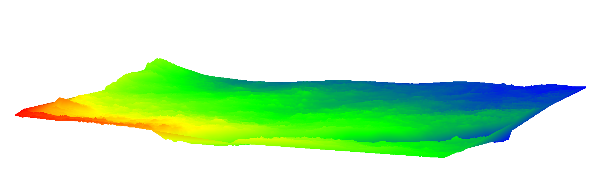
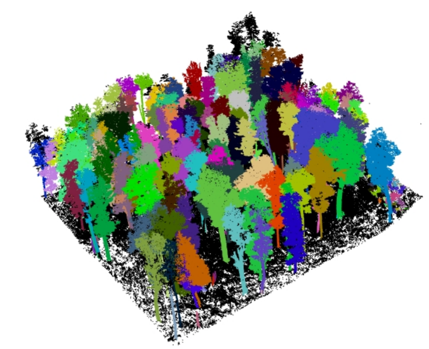
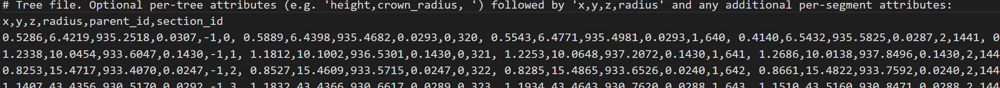
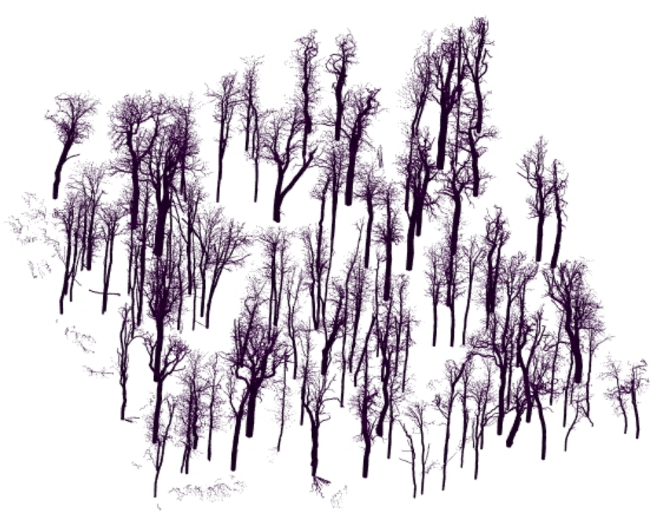
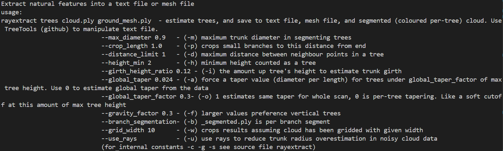
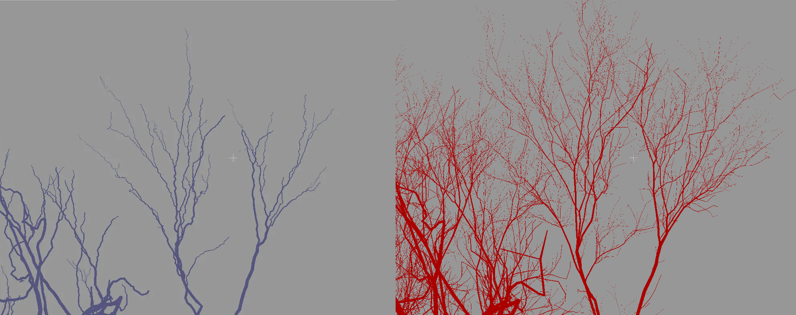

# Rayextract manual
This repository includes explanation and additional functionality for using [Raycloudtools](https://github.com/csiro-robotics/raycloudtools) (RCT) and [Treetools](https://github.com/csiro-robotics/treetools) for forest point cloud processing.

**Table of content**:

- [Installation](#installation)
- [Overview](#overview)
- [First Steps](#first-steps)
- [RCT workflow for plot point clouds](#rct-for-forest-plot-point-clouds)
   - [input](#input)
   - [rayimport](#rayimport-convert-pointcloud-to-raycloud)
   - [rayextract terrain](#rayextract-terrain-extract-and-fit-terrain-mesh-from-point-cloud)
   - [rayextract trees](#rayextract-trees-extract-individual-trees-and-build-qsms-from-point-cloud)
   - [raysplit & treesplit](#raysplit-and-treesplit-split-the-segmented-point-cloud-and-treefile-into-individual-trees)
   - [treemesh](#treemesh-make-a-triangular-mesh-from-the-treefile-aka-qsm)
- [Dealing with large plots](#dealing-with-large-plots)
- [RCT for individual tree point clouds](#rct-for-individual-tree-point-clouds)
   - [Virtual forest reconstruction](#virtual-forest-reconstruction)
   - [Tree volume](#tree-volume)
- [Leaf wood segmentation with RCT](#leaf-wood-segmentation)
- [Visualisation and quality control](#visualisation-and-quality-control)


## Installation

See [installation.md](./installation.md) for installation instructions. 

## Overview

[Raycloudtools](https://github.com/csiro-robotics/raycloudtools) is a set of command line tools and corresponding C++ library for working with *rayclouds*. A raycloud is similar to a point cloud but for each target point the beam origin is also stored (or a ray can also have no return). A subset of these commands (mostly grouped under the name *rayextract*), as well as the accompanying commands from the [Treetools](https://github.com/csiro-robotics/treetools) library, can be used to process forest and tree point clouds. Note that the considered functionality doesn't use the *ray* information but just the point cloud.

### What can you do
- Tree **instance segmentation** of forest plot point clouds.
- Build **QSMs** simultaniously for the whole forest or for a single tree point cloud.
- Convert the connected cylinder representation (=QSM) to a **triangular tree mesh**.
- **Ground mesh** (DEM) fitting for the forest plot point cloud.
- Leaf wood segmentation of tree point clouds

### Why use RCT

RCT is relatively easy to set up, computationally fast, and currently state-of-the-art for tree instance segmention and tree volume estimation ([Devereux et al (2025)](https://www.sciencedirect.com/science/article/pii/S0034425725005668?via%3Dihub), [Cherlet et al (2025)](https://www.sciencedirect.com/science/article/pii/S092427162500423X)).  

### Limitations

- Rayextract can fail to reconstruct a tree with sometimes no options to fix this (limited user definable parameters and not stochastic).
- Rayextract is made for plot level point point clouds and not for single tree point clouds. You can run it on a single tree but since there's no way of inputting that it's a single tree it might segment it into multiple trees.
- It doesn't work well for trees with buttresses. 

## First steps

- Have a look at the [Raycloudtools](https://github.com/csiro-robotics/raycloudtools) and [Treetools](https://github.com/csiro-robotics/treetools) repositories.
- Read the paper by [Devereux et al (2026)](https://www.sciencedirect.com/science/article/pii/S0034425725005668?via%3Dihub) to understand how Rayextract works.
- Have a look at the nice [info and notebooks](https://github.com/tim-devereux/TLS_Workshop/tree/main) by Tim Devereux to get you started hands-on with RCT. 

## RCT for forest plot point clouds

A general overview of the rayextract workflow is given in the figure below:



> :bulb: **Tip**: If you type any of the commands (without arguments) into the command line and press enter this will display the arguments and more information for the command.

### Input

The input is a **forest plot point cloud in ply format** which we here call `pcd.ply`. Just XYZ information is sufficient. Depending on how you installed RCT it will also work with las(z) files, but it might not work for all versions. If you experience errors using a las(z) file, we recommend converting it to ply first. 

> :bulb: Rayextract can work with both leaf-on and leaf-off point clouds!

For easier downstream processing, we recommend to pre-process your point cloud prior to using RCT:
- **Filter out noise points**: filter on reflectance and deviation thresholds, and remove isolated points.
   > :warning: Make sure to filter out isolated/floating points below the surface and above the canopy! This may crash or negatively affect rayextract output!  
- **Crop** (e.g. to a rectangular region of interest + buffer)
- **Downsample** (e.g. to 1cm voxel resolution)
- **Axes align**: rotate your point cloud such that it is axes aligned (tip: keep track of your rotation and transformation matrices to be able to do a reverse transform!).

You can do this pre-processing for example within Riscan Pro or CloudCompare, or use the functionality in the [QFL-3Dtools](https://github.com/qforestlab/QFL_3Dtools) library.

### *rayimport*: Convert pointcloud to raycloud

The *rayextract* command (see next step) expects as input a '.ply' file with the beam origin of the points stored in the normal field. However, for the RCT tools useful for forest point cloud processing these are not actually used. Nonetheless, the normal fields must be there in order for the tool to work. The `rayimport` command can add these (empty) fields to your input file.

Use the following command to convert your point cloud file to the correct format:  

```
rayimport <pcd.ply> ray 0,0,-1 --max_intensity 0
```

- `<pdc.ply>`: replace with your point cloud
- `ray 0,0,-0.1`: use 0,0,-0.1 as the constant ray vector from start to point (stored in the normal field)
- `--max_intensity 0`: set all rays to be bounded (having an end point)
- `--remove_start_pos` (optional): This will subtract the start position of the pointcloud such that the left bottom corner has coordinates 0,0,0. This is optional, but recommended if your pointcloud has large values (leading to potential precision overflow errors), for example when working with global coordinates. However, we recommend translating and rotating you pointcloud prior to using rayextract (keep track of your transformation matrices!).


The output will be a file called `pcd_raycloud.ply` (original point cloud name + *_raycloud* suffix) saved to your working directory. 

### *rayextract terrain*: Extract and fit terrain mesh from point cloud 

Now that we have our forest point cloud in the correct format, we can extract the terrain mesh (DEM). Use the following command:

```
rayextract terrain <pcd_raycloud.ply>
```

- `<pcd_raycloud.ply>`: replace with your imported point cloud

The output is a file called `pcd_raycloud_mesh.ply` (imported point cloud + *_mesh* suffix), which is a triangular terrain mesh file. 



### *rayextract trees*: Extract individual trees and build QSMs from point cloud

How it works: the tree extraction algorithm takes as input (1) our original point cloud and (2) the extracted terrain mesh from the previous step. The terrain mesh will be uses as seed points to simultaniously build a shortest path graph through all the tree points, using some heuristics to guide the connectivity. Hence, it combines tree instance segmentation, leaf-wood segmentation and cylinder skeleton fitting (i.e., QSM). For more information see [Devereux et al (2026)](https://www.sciencedirect.com/science/article/pii/S0034425725005668?via%3Dihub).

Run the following command:

```
rayextract trees <pcd_raycloud.ply> <pcd_raycloud_mesh.ply>
```

- `<pcd_raycloud.ply>`: replace with your imported point cloud
- `<pcd_raycloud_mesh.ply>`: replace with the generated terrain mesh from the previous step.

The output are three files:
1) `pcd_raycloud_segmented.ply`: The original pointcloud but with a unique color for each extracted tree. The non-tree points are colored in black.

   

2) `pcd_raycloud_trees.txt`: We will call this a *treefile*, which contains the cylinder models of all the extracted trees (i.e. the QSMs). 

   If you open the *treefile* it looks as follows:

   

   Each line corresponds to the connected cylinder representation (i.e. QSM) of one tree. For each tree, the cylinders are encoded as a list of [*x,y,z,radius,parent_id,section_id*] elements separated by spaces. When you connect a certain point with corresponding radius to its parent point you derive the cylinder. For more information on the treefile format have a look at the [treetools](https://github.com/csiro-robotics/treetools) library.
3) `pcd_raycloud_trees_mesh.ply`: All tree woody structures as triangular meshes. This is a triangularization of the tree cylinder models in the *treefile* above. 

   

There are a few parameters that you can change when using *rayextract trees*. If you just type `rayextract trees` without any arguments on the command line and press enter you will get an overview of the parameters that you can change:



The parameters of most interest to us are:
- `--max_diameter` (default `0.9`): maximum tree diameter that can be expected in your plot. Increase this value if you have larger trees in your plot (e.g. tropical plots)
- `--crop_length` (default `1.0`): by default the cylinder graph will be build up to one meter from the end of the point cloud. Decreasing this value (minimum is 0.1m) will result in more small branches at the extremities (see for example image below).

   

   For volume calculations, you can keep the default value as most tree volume is located in the main stem and branches. However, for tree reconstruction for radiative transfer simulations it can be important to decrease this value! Keep in mind that generating more small branches will exponentially increase the file size.
- `--height_min` (default `2`): minimum height counted as a tree. Note, this is calculated as the tree length and not the vertical height (e.g. fallen trees can potentially also be identified).
- `--global_taper`, `--global_taper_factor`, `--gravity_factor`: you can play around with these to change the tapering vertical preference for trees.

### *raysplit* and *treesplit*: Split the segmented point cloud and treefile into individual trees

Now that we have the instance segmented point cloud and the treefile, we can split them into the individual trees. This will make it easier for quality control of the automated segmentation and cylinder fitting.

To split the segmented pointcloud into individual tree point clouds you can use the following command:

```
raysplit <pcd_raycloud_segmented.ply> seg_colour
```

- `<pcd_raycloud_segmented.ply>`: replace with your segmented point cloud

The output will be one file for each detected tree (`pcd_raycloud_segmented_0.ply`, `pcd_raycloud_segmented_1.ply`, ...), plus the remainder point cloud which is represented by the suffix -1 (`pcd_raycloud_segmented_-1.ply`).

To split the treefile into separate files for each tree you can use the following command:

```
treesplit <pcd_raycloud_trees.txt> per-tree
```
- `<pcd_raycloud_trees.txt>`: replace with your treefile

The output will be one file for each tree (`pcd_raycloud_trees_0.txt`, `pcd_raycloud_trees_1.txt`, ...), where the numbering matches the numbering of the splitted tree point clouds.  


### *treemesh*: Make a triangular mesh from the treefile (aka QSM)

Since it is not possible to split the `pcd_raycloud_trees_mesh.ply` file into individual tree meshes, we have to use the treefile(s) (`pcd_raycloud_trees_X.txt`, see previous step) and convert these into a triangular mesh. 

For a single treefile, you can use the following command:

```
treemesh <pcd_raycloud_trees_X.txt>
```
- `<pcd_raycloud_trees_X.txt>`: replace with your treefile

This will output the file `pcd_raycloud_trees_X_mesh.ply`. 

If you want to convert all the treefiles in a directory to meshes you can use the bash script [`loop_directory.sh`](./scripts/loop_directory.sh) in this repository to loop over a directory and apply the command to each file:

```
bash ./loop_directory.sh <tree_file_directory> treemesh
```
- `<tree_file_directory>`: replace with your directory holding all treefiles

## Dealing with large plots

For large point clouds RCT may crash because of memory limitations. In this case, there are two options: (1) downsample your point cloud, (2) split your point cloud into tiles and run rayextract on the tiles.

For the second option, You can use the provided [bash script](https://github.com/qforestlab/raycloudtools/blob/main/scripts/rayextract_trees_large.sh), which runs `raysplit grid` to split the point cloud into tiles with a certain buffer, runs `rayextract terrain` and `rayextract trees` for each tile (keeping only trees with base of the stem within the tile), and then runs `treecombine` to combine the trees to a single treefile.txt.

For example:
```
bash <path_to_file/rayextract_trees_large.sh> <your_pointcloud_raycloud> <tile_size>
```
- `<path_to_file/rayextract_trees_large.sh>`: replace with the path to the [rayextract_trees_large.sh](https://github.com/qforestlab/raycloudtools/blob/main/scripts/rayextract_trees_large.sh) file
- `<pcd_raycloud>`: replace with path to your point cloud (in RCT format).
- `<tile_size>`: replace with tile size (e.g. 20), to use  tiles of 20x20m. 

We recommend increasing the default buffer size of 5m in the script a bit (depending on the max width of the trees).

You can also have a look at the [rayextract_tiled_individual_trees.sh](./scripts/rayextract_tiled_individual_trees.sh) bash script in this repository, which extends the above script to include splitting, tree filtering and meshing.

> :warning: If you run rayextract on tiles, the remainder point cloud (with index = -1) might produce unexpected results.

## RCT for individual tree point clouds

While RCT is made to work for forest plot point clouds, it can also be applied to single tree point clouds. You can use the bash script [rayextract_single_trees.sh](./scripts/rayextract_single_trees.sh) in this repository to loop over single tree point clouds in a directory (.ply format) and run `rayimport` -> `rayextract terrain` -> `rayextract trees` on each tree:

```
bash <rayextract_single_trees.sh> <directory>
```

- `<rayextract_single_trees.sh>`: replace with path to the [rayextract_single_trees.sh](./scripts/rayextract_single_trees.sh) script
- `<directory>`: replace with path to the directory with individual tree point clouds (expects ply files) 

The output will be a new directory (`<directory>_rayextract`) with five subdirectories:
1. `raycloud_files`: point cloud files in RCT format outputted by `rayimport`
2. `ground_mesh_files`: terrain mesh files outputted by `rayextract terrain`
3. `trees_mesh_files`: tree triangular meshes outputted by `rayextract trees`
4. `trees_QSM_files`: *treefiles* (=QSMs) outputted by `rayextract trees`
5. `trees_segmented_files`: segmented tree point clouds outputted by `rayextract trees`


**Important:** Since `rayextract trees` is made to operate on forest plot point clouds, it is possible that when running it on a single tree point cloud it can segment it into multiple instances. At the moment, there is unfortunatelly no option to let rayextract know that you're inputting a single tree. You should therefore check in the output that there is only a single line in the *_trees.txt* or that there is only a single color in the *_segmented.ply* files.  

Cases where rayextract may segment your individual tree point cloud into multiple instances:
- Stem base points are noisy: the extracted terrain mesh may be very steep and large, hence extending to higher branches. Potential fix: (1) manually clean your base stem points, (2) use a plot level terrain mesh if available, (3) change the `--gradient` parameter in `rayextract terrain` to a lower value.
- Low hanging branches: these may be detected as seed points to build seperate trees. Potential fix: (1) partially remove these low branches (e.g. in CloudCompare), or (2) crop the terrain mesh to only cover the main stem. 


### Virtual forest reconstruction

As explained in the [rayextract trees](#rayextract-trees-extract-individual-trees-and-build-qsms-from-point-cloud) section, the `--crop_length` parameter will have a significant effect on the number of small branches that are constructed. Therefore, we provide a slightly adapted script to process single tree point clouds for making tree reconstructions which can be used as input for e.g. radiative transfer models. This script will also apply the commands `treesmooth` and `treedecimate` to reduce the number of cylinders for memory purposes. 

```
bash <rayextract_single_trees_vf.sh> <directory>
```
- `<rayextract_single_trees_vf.sh>`: replace with path to the [rayextract_single_tree_vf.sh](./scripts/rayextract_single_tree_vf.sh) script.
- `<directory>`: replace with path to directory with single tree point clouds (ply files)

The output is similar as [above](#rct-for-individual-tree-point-clouds).


### Tree volume

There are two options for getting the total volume for a single tree: 

1. You can use the [treefile2volume.py](./scripts/treefile2volume.py) python script in this repository, which will simply sum up the volume of all cylinders for each tree and return a csv file with the volumes. This script assumes a single line in each treefile (only one tree)!

   ``` 
   python treefile2volume.py <directory> <output.csv>
   ```
   - `<directory>`: replace with path to your directory with the *treefiles*. 
   - `<output.csv>`: path to the output csv file

2. You can use the `treeinfo` command to derive more information for each *treefile*, including the total tree volume:

   ```
   treeinfo <treefile> 
   ```
   - `<treefile>`: replace with your *treefile* (*_trees.txt)

This will output a file `*_trees_info.txt` which includes more information for the tree and more per branch attributes. The total tree information can be found on the 'root segment' (i.e. the first element) such as the volume and tree height.


## Leaf wood segmentation

To run leaf-wood segmentation using RCT, you can use the following approach:

```
raysplit <pcd_raycloud.ply> <pcd_raycloud_trees.txt> distance <distance>
```
- `<pcd_raycloud.ply>`: replace with your point cloud (in RCT format)
- `<pcd_raycloud_trees.txt>`: replace with the extracted treefile (or correponding mesh file), which is the output from [rayextract trees](#rayextract-trees-extract-individual-trees-and-build-qsms-from-point-cloud).
- `<distance>`: replace with a distance value from the woody mesh. All points further away than this distamce will be considered leaf points.

The output will be two files: `pcd_raycloud_inside.ply` (woody points) and `pcd_raycloud_outside.ply` (leaf points)

## Visualisation and quality control

Once you have individual tree point clouds and meshes (/treefiles), you can visualize them for quality control. 

You can first use the script [make_tree_dataframe.py](./scripts/make_tree_dataframe.py) to make a summary csv file:

```
python <make_tree_dataframe.py> <dir_treefile> <dir_out>
```
- `<make_tree_dataframe.py>`: replace with path to [make_tree_dataframe.py](./scripts/make_tree_dataframe.py) script
- `<dir_treefile>`: replace with path to directory with treefiles
- `<csv_out>`: replace with path to output csv file

The output is a csv file with columns [*filename, id, x, y, z, d, selection*]. This dataframe will allow us to more easily filter on location or diameter, or set a decision (i.e. selection status) in the *selection* column.

[TODO] Next, we can visualize the individual tree point cloud overlayed with its triangular mesh. You can for example do this using the [visualise_and_select_open3d.py](./scripts/visualise_and_select_open3d.py) script. This script uses the *open3d* package to loop over all trees, visualize the point cloud and mesh and use hot keys to set a selection status for the tree. 

> ### Hot keys on QWERTY keyboard
> `[` Toggle point cloud
> 
>  `]` Toggle mesh
> 
> `u` Set selection column in csv file to 'understory' for that treefile
> 
> `t` Set selection column in csv file to 'tree' for that treefile
> 
> `s` Set selection column in csv file to 'snag' for that treefile
> 
> `f` Set selection column in csv file to 'fix' for that treefile
> 
> `r` Set selection column in csv file to 'reject' for that treefile
>


If you directly want to visualise the *treefile* (i.e. QSM) instead of the triangulated mesh, you can for example use the function in the [visualise_treefile.py](./scripts/visualise_treefile.py) file.

Once you are finished with quality control for all trees, you can copy the selected trees to a new directory with the script
[copy_selected_trees.py](./scripts/copy_selected_trees.py).

## Rerunning rayextract on non satisfactory QSM results
After the quality control, you can use [rerun_bad_qsm.py](./scripts/rerun_bad_qsm.py) to mess around with parameters until the QSMs reach your needs.
There are a few parameters you can adjust. The one that usually solves most issues is lowering the `--gradient` parameter in *rayextract terrain*, or providing the plot-level terrain mesh.

Additionally, you can tweak some parameters in *rayextract trees*, with the most important ones being `max_diameter`, `girth_height_ratio`, `gravity_factor`, `global_taper`, and `distance_limit`.

The parameters are default set to the raycloudtools default value but can easily be changed to the desired values by adding them as arguments (e.g. `--gradient 0.15`).


