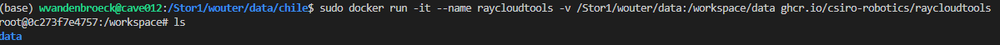

# Installation instructions for Raycloudtools and Treetools

We provide instructions for installing Raycloudtools and Treetools using either Docker or a source install. Alternatively, you can also follow the instructions using [WSL and Apptainer](https://github.com/tim-devereux/TLS_Workshop/tree/main) (similar to Docker).

- [Docker](#installation-with-docker): works for all operating systems.
- [Source install](#installation-from-source): instructions only for **linux**. Recommended if you don't want to be bothered with using Docker (using Docker adds a tiny bit of complexity and might give access right issues on a shared server).

> As a **Windows** user, you can choose to either use Docker on windows, or install [**Windows Subsystem for Linux (WSL)**](https://learn.microsoft.com/en-us/windows/wsl/about) which allows you to run a Linux environment on your Windows machine. You can then use either Docker or the source install within WSL.


## Installation with Docker

### What is Docker

 [Docker](https://www.docker.com/) is a software that makes a 'virtual environment' on your computer, allowing you to run any application build with any arbitrary operating system (OS). This means that once you have Docker installed (be it on Windows, Mac or Linux), you can just use/download any Docker application and run it without worrying about package versions or dependencies. In Docker jargon, an application is called an *image*, and a running instance of an image is called a *container*. 

If you are unfamiliar with Docker, we recommend to first take some time to familiarize yourself with it. 


### Download Docker and the Raycloudtools image

1. Install Docker (either Docker Desktop for Windows or via the command line for Linux)
2. Download the latest raycloudtools docker image:

   ```
   docker pull ghcr.io/csiro-robotics/raycloudtools:latest
   ```

   Here `ghcr.io/csiro-robotics/raycloudtools:latest` is the name of the image that we're downloading ('pulling'), provided by the developers of raycloudtools. 

    > If there are updates made to raycloudtools you should download the image again.

### Run the Raycloudtools container

Each time you want to use Raycloudtools you'll have to first start the raycloudtools docker container.

For linux (you might have to use `sudo` before the command for root permissions):

```
docker run -it --rm --name raycloudtools -v <local path>:<container path> ghcr.io/csiro-robotics/raycloudtools:latest /bin/bash
```
Explanation of command parameters:
- `-it`: used to run the container in interactive mode (create an interactive bash shell inside the container)
- `--rm`: used to automatically remove the container after usage (i.e., after exiting the bash terminal inside the container).
- `--name raycloudtools`: give the name 'raycloudtools' to the running container.
- `-v <local path>:<container path>`: map your local file system (`<local path>`) to the container file system (`<container path>`). Note the `:` symbol in between the two paths!

    Normally, all files are packaged within the docker container such that you don't have access to your local the filesystem from within the container. However, if you use this mapping you will have access to the specified local folders (but not to any other folders!). Usually, you just need access to your datafiles that you want to process with rayextract, so the specified folder can be the one containing all your data. You have to replace `<local path>` with the absolute path to your datafolder on your computer, and `<container path>` with the absolute path inside the docker container. Since the container is running linux, the container path is specified with forward slashes ('/'), starting from the 'root' (first '/'). The provided raycloudtools docker image has by default a folder called `/workspace`, which is the entry point when running the container. Therefore, for example, you can map your datafolder as follows:

    Windows: `C:/Users/YourUsername/.../projectname/data:/workspace/data`

    Linux: `/home/username/.../projectname/data:/workspace/data`

    WSL: `/mnt/c/Users/username/.../projectname/data:/workspace/data`

    > :warning: Make sure you put your path in between quotation marks (") if it contains spaces!


If all went well you now have access to a bash terminal inside the container:



 Inside this linux terminal you can use all the regular linux commands. For example, use `cd data` ('change directory') to navigate into the data folder or use the `ls` command to list all the files/foldes inside the current folder. If you don't find your data files, this means something went wrong with how you mapped your file paths!
 
 Now, you can run all the raycloudtools commands described in the [manual](./README.md). 

 ### Exit the container
 
 To exit the docker container you can press `CTRL+d`. 

 ## Installation from source

> These are instructions only for **Linux**!

If you want an alternative to docker, or a static image of raycloudtools locally, you can install from source with the following instructions:

1. Install the 'extra' libraries needed for our specific funcionality of rayextract and treetools.
   It's recommended to install all the following in /home/user, or another level down in a custom directory

   a. LASzip
   ```
   git clone https://github.com/LASzip/LASzip.git
   cd LASzip
   git checkout tags/2.0.1
   mkdir build
   cd build
   cmake ..
   make
   sudo make install
   ```
   b. libLAS
   ```
   sudo apt-get install libboost-all-dev
   git clone https://github.com/libLAS/libLAS.git
   cd liblas
   mkdir build
   cd build
   cmake .. -DWITH_LASZIP=ON
   make
   sudo make install
   ```
   c. qhull
   ```
   git clone http://github.com/qhull/qhull.git
   cd qhull
   checkout tags/v7.3.2
   mkdir build
   cd build
   cmake .. -DCMAKE_POSITION_INDEPENDENT_CODE:BOOL=true
   make
   sudo make install
   ```
   
2. Install the core of raycloudtools and treetools

   a. Raycloudtools
   ```
   sudo apt-get install libeigen3-dev
   git clone https://github.com/ethz-asl/libnabo.git
   cd libnabo
   git checkout tags/1.0.7
   mkdir build
   cd build
   cmake .. -DCMAKE_BUILD_TYPE=RelWithDebInfo
   make
   sudo make install
   cd ../..
   git clone https://github.com/csiro-robotics/raycloudtools.git
   cd raycloudtools
   mkdir build
   cd build
   cmake .. -DWITH_LAS=ON -DWITH_QHULL=ON
   make
   ```
   b. TreeTools
   ```
   git clone https://github.com/csiro-robotics/treetools
   mkdir build
   cd build
   cmake ..
   make
   ```
   
3. Edit your bashrc via:
   ```
   sudo nano ~/.bashrc
   ```
   At the end of the file, add three lines:
   ```
   export PATH=$PATH:~/RCT/raycloudtools/build/bin
   export PATH=$PATH:~/RCT/treetools/build/bin
   console export LD_LIBRARY_PATH=$LD_LIBRARY_PATH:/usr/local/lib
   ```
   These three lines allow you to call tools from both packages in any directory (important for batching scripts), and paths them to required lib files.
   **Restart your console for this step to take effect**.
   
